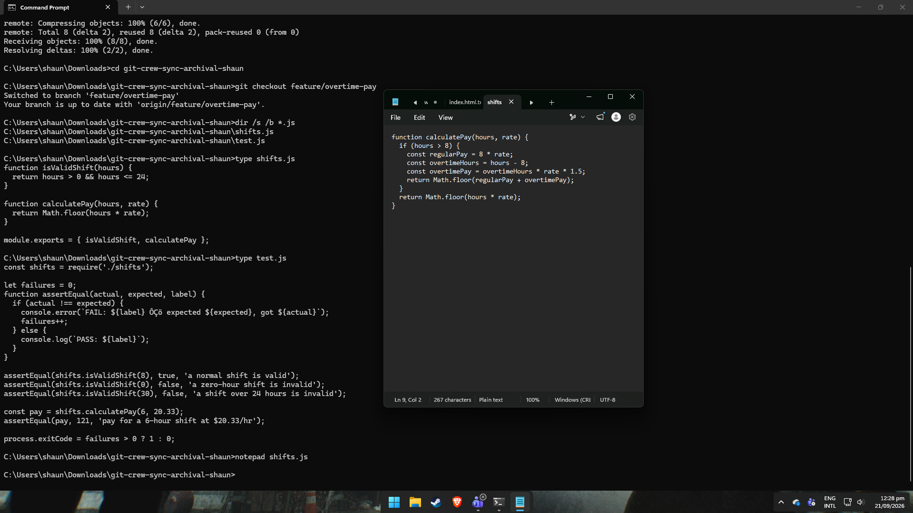
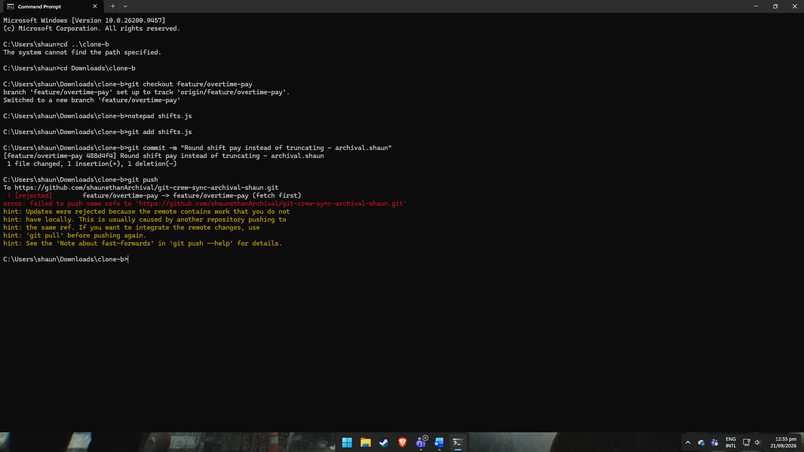
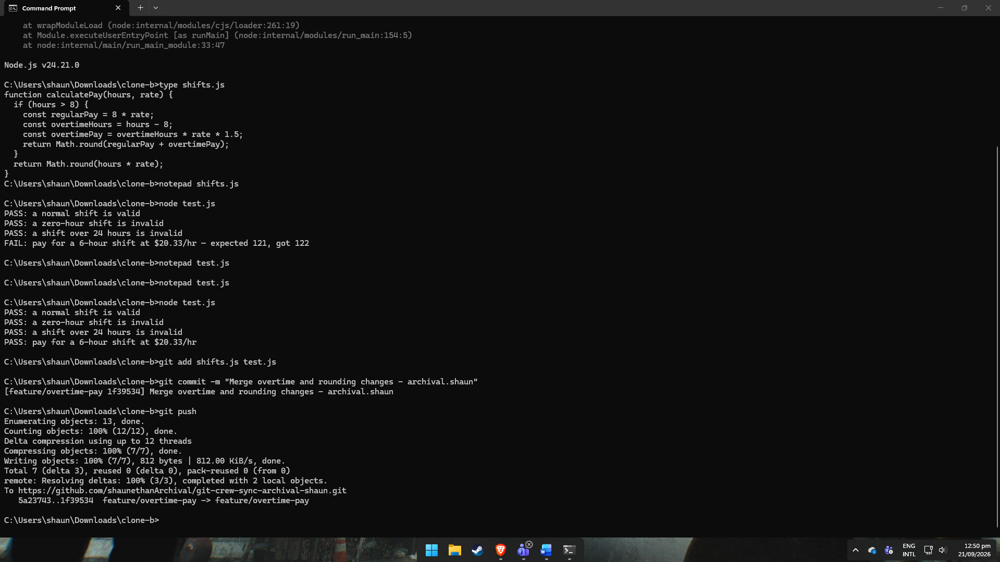
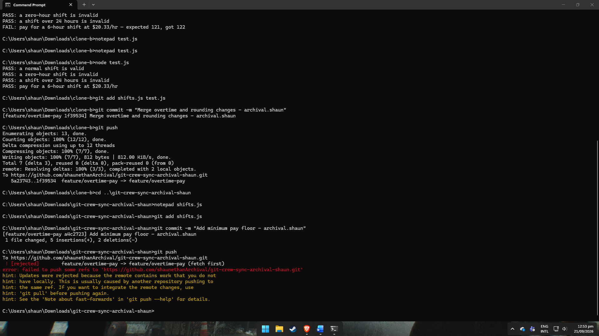
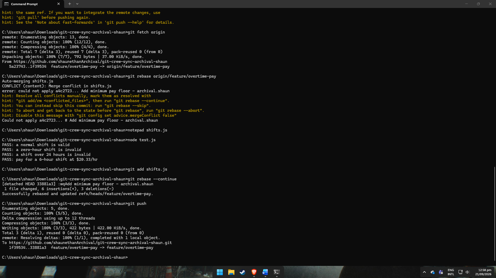
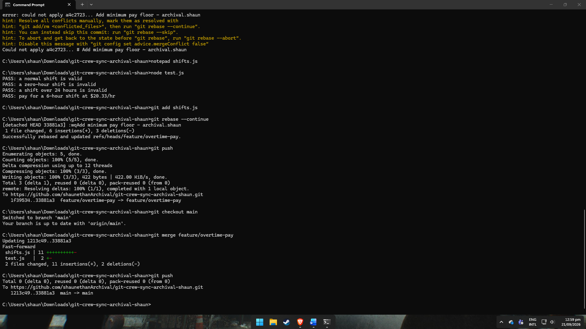
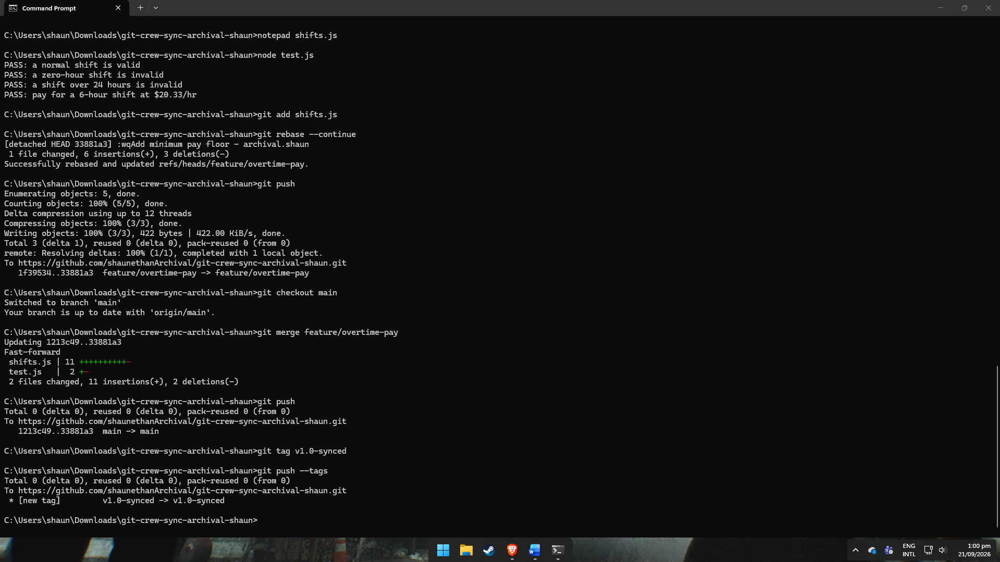
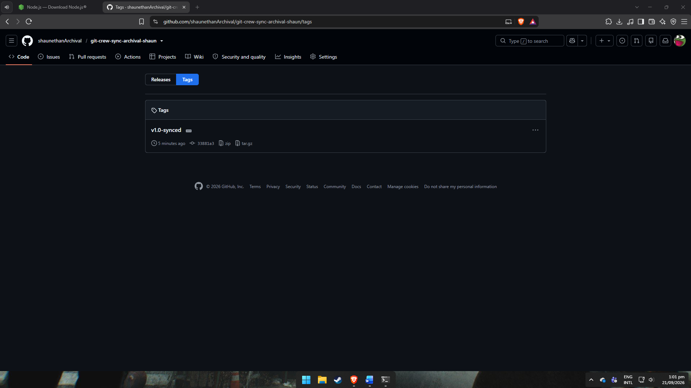

# WORKFLOW.md

## What did the rejected push error message tell you, and why did it happen?
The error said updates were rejected because the remote had commits I didn't have locally. It happened because I made changes and tried to push without fetching first — someone else (my other clone) had already pushed to the same branch, so Git refused to overwrite history it didn't know about.

## What's the actual difference between how you resolved Task 3 (merge) vs Task 4 (rebase)?
The merge in Task 3 created a new commit that combined both branches' histories side by side — you can see both parent commits in the log. The rebase in Task 4 replayed my local commit on top of the latest remote commit instead, so the history stayed linear with no merge commit, but it rewrote my commit's hash in the process.

## What one habit would have avoided both rejected pushes in this lab?
Running git fetch (or git pull) before starting any new work and before pushing would have caught the divergence early, instead of finding out only after trying to push.

## Which approach — merge or rebase — would you default to on a shared team branch, and why?
Merge. On a branch other people are actively pulling from, rebase rewrites commit history, which can cause serious problems for anyone who already has the old commits. Rebase is safer to use only on local commits that haven't been pushed yet.

## Screenshots

### Task 1

### Task 2

### Task 3

### Task 4

### Task 5

### Task 6

